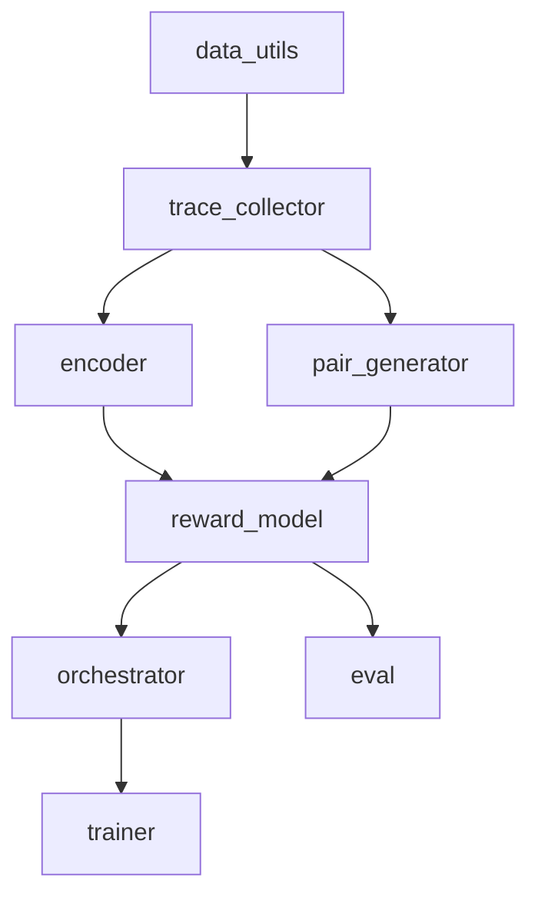

<p align="center">
  
</p>

<h1 align="center">OrchestrateRM</h1>

<p align="center">
  <strong>Self‑supervised Bradley‑Terry reward model for multi‑agent orchestration.</strong>
</p>

<p align="center">
  <a href="https://github.com/Lumi-node/orchestrator-rm"></a>
  <a href="https://github.com/Lumi-node/orchestrator-rm/blob/main/LICENSE"></a>
  <a href="https://pypi.org/project/orchestrator-rm/"></a>
  <a href="https://github.com/Lumi-node/orchestrator-rm/actions"></a>
</p>

---

OrchestrateRM provides a **self‑supervised reward model** built on the Bradley‑Terry framework to evaluate and improve the quality of multi‑agent orchestration. By learning from pairwise comparisons of execution traces, the model can rank agents, guide policy‑gradient updates, and serve as a plug‑and‑play component for research on collaborative AI systems.

The library ships with a full training pipeline, data utilities, a trace collector, and a lightweight encoder, making it straightforward to experiment with new orchestration strategies or integrate the reward model into existing reinforcement‑learning loops.

---

## Quick Start

```bash
pip install orchestrator_rm
```

```python
from orchestrator_rm.orchestrator import Orchestrator
from orchestrator_rm.reward_model import OrchestratorRewardModel
from orchestrator_rm.trainer import train

# Initialise components
orchestrator = Orchestrator()
reward_model = OrchestratorRewardModel()

# Train the reward model (self‑supervised)
train(orchestrator, reward_model, epochs=10)
```

## What Can You Do?

### Evaluate Pairwise Preference
```python
from orchestrator_rm.eval import evaluate_pairwise

trace_a = {"steps": [...], "metadata": {...}}
trace_b = {"steps": [...], "metadata": {...}}

result = evaluate_pairwise(trace_a, trace_b)
print(result)  # {'winner': 'trace_a', 'probability': 0.73}
```

### Generate Contrastive Pairs
```python
from orchestrator_rm.pair_generator import generate_pairs
from orchestrator_rm.trace_collector import TraceCollector

collector = TraceCollector()
traces = collector.collect(query="schedule_meeting", strategy=["agentA", "agentB"])
pairs = generate_pairs(traces)

# pairs is a list of (trace_a, trace_b) tuples ready for training
```

### Score a Single Trace
```python
from orchestrator_rm.reward_model import OrchestratorRewardModel

model = OrchestratorRewardModel()
score = model.score(trace={"steps": [...], "metadata": {...}})
print(f"Trace score: {score:.4f}")
```

## Architecture

```
data_utils.py      → utilities for query handling & dataset creation
trace_collector.py → collects execution traces from registered agents
encoder.py         → PositionalEncoding & TraceEncoder (tokenizes & encodes traces)
pair_generator.py  → builds contrastive pairs from collected traces
reward_model.py    → OrchestratorRewardModel (Bradley‑Terry scoring)
orchestrator.py    → Orchestrator (policy network, agent selection)
eval.py            → evaluation helpers (pairwise, acceptance test)
trainer.py         → high‑level training loop tying everything together
cost_metric.py     → cost calculation for a given trace
```



## API Reference

### `orchestrator_rm.cost_metric.cost(trace: dict) -> float`
Computes a scalar cost for a single trace.

### `orchestrator_rm.data_utils`
- `handler(query, ctx)` – generic query handler (multiple overloads).
- `queries(self) -> List[str]`
- `collector(self) -> TraceCollector`
- `agent_names(self) -> List[str]`
- `make_dataset(num_queries: int = 50, traces_per_query: int = 4) -> List[dict]`
- `make_contrastive_pair() -> tuple`

### `orchestrator_rm.encoder.PositionalEncoding(nn.Module)`
- `forward(self, x: torch.Tensor) -> torch.Tensor`

### `orchestrator_rm.encoder.TraceEncoder(nn.Module)`
- `get_agent_id(self, agent_name: str) -> int`
- `tokenize_trace(self, trace: dict) -> dict`
- `encode(self, trace: dict) -> torch.Tensor`
- `encode_batch(self, traces: List[dict]) -> torch.Tensor`

### `orchestrator_rm.eval.evaluate_pairwise(self, trace_a: dict, trace_b: dict) -> dict`
Returns the winner and Bradley‑Terry probability.

### `orchestrator_rm.eval.run_acceptance_test(self) -> bool`
Runs a sanity‑check acceptance test on the reward model.

### `orchestrator_rm.orchestrator.Orchestrator(nn.Module)`
- `forward(self, partial_trace: dict) -> torch.Tensor`
- `select_agent(self, ...)`
- `run(self, query: str) -> dict`
- `policy_gradient_step(self, ...)`

### `orchestrator_rm.pair_generator.generate_pairs(traces: List[dict]) -> List[Tuple[dict, dict]]`

### `orchestrator_rm.reward_model.OrchestratorRewardModel(nn.Module)`
- `forward(self, trace: dict) -> torch.Tensor`
- `score(self, trace: dict) -> float`
- `fit(self, ...)`
- `save(self, path: str)`
- `load(self, path: str)`

### `orchestrator_rm.trace_collector.TraceCollector`
- `register_agent(self, name: str, handler: AgentHandler)`
- `agent_names(self) -> List[str]`
- `collect(self, query: str, strategy: List[str], seed: Optional[int] = None) -> dict`
- `step(self, partial_trace: dict, agent_name: str, rng=None) -> dict`

### `orchestrator_rm.trainer.train(...)`
High‑level training entry point that orchestrates data collection, pair generation, and reward‑model updates.

## Research Background

OrchestrateRM builds on the **Bradley‑Terry** model for pairwise preference learning, extending it to multi‑agent orchestration contexts. The approach follows recent work on self‑supervised reward modeling for language agents (e.g., *OpenAI* “Learning to Summarize with Human Feedback”) and adapts it to trace‑level evaluation. See:

- Bradley, R. A., & Terry, M. E. (1952). *Rank analysis of incomplete block designs*. *Biometrika*.
- Stiennon, N. et al. (2020). *Learning to summarize with human feedback*. *NeurIPS*.

Full details are available in the project documentation.

## Testing

The repository includes **9** test files covering data utilities, encoder behavior, reward scoring, and end‑to‑end training loops. Run the test suite with:

```bash
pytest -v
```

## Contributing

We welcome contributions! Please:

1. Fork the repo.
2. Create a feature branch (`git checkout -b feat/your-feature`).
3. Write tests for new functionality.
4. Submit a pull request with a clear description.

See `CONTRIBUTING.md` for detailed guidelines.

## Citation

If you use OrchestrateRM in academic work, please cite:

```bibtex
@software{young2026orchestraterm,
  author = {Young, Andrew},
  title = {OrchestrateRM: Self‑supervised Bradley‑Terry reward model for multi‑agent orchestration},
  year = {2026},
  url = {https://github.com/Lumi-node/orchestrator-rm},
  license = {MIT}
}
```

## License

Distributed under the **MIT License**. See `LICENSE` for details.