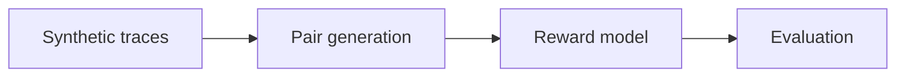

# Architecture

OrchestrateRM is organized around a small set of modules that form a pipeline:

## Modules

| Module | Description |
|--------|-------------|
| `cost_metric` | — |
| `data_utils` | — |
| `encoder` | — |
| `eval` | — |
| `orchestrator` | — |
| `pair_generator` | — |
| `reward_model` | — |
| `trace_collector` | — |
| `trainer` | — |
